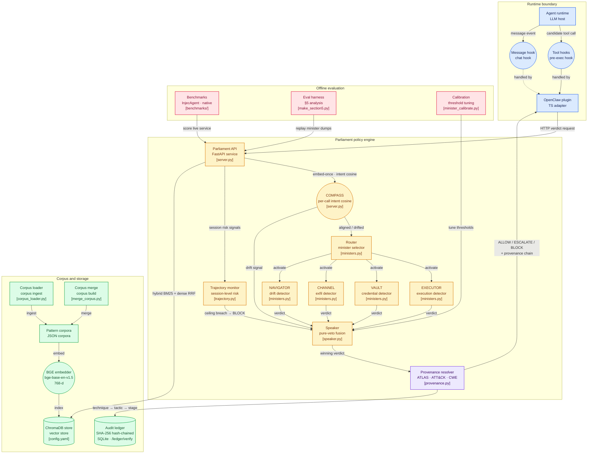

```mermaid
flowchart TD

subgraph group_runtime["Runtime boundary"]
  node_agent_runtime["Agent runtime\nLLM host"]
  node_openclaw_plugin["OpenClaw plugin\nTS adapter"]
  node_tool_hooks(("Tool hooks\npre-exec hook"))
  node_message_hook(("Message hook\nchat hook"))
end

subgraph group_policy["Parliament policy engine"]
  node_parliament_server["Parliament API\nFastAPI service\n[server.py]"]
  node_compass(("COMPASS\nper-call intent cosine\n[server.py]"))
  node_trajectory["Trajectory monitor\nsession-level risk\n[trajectory.py]"]
  node_router["Router\nminister selector\n[ministers.py]"]
  node_executor_minister["EXECUTOR\nexecution detector\n[ministers.py]"]
  node_vault_minister["VAULT\ncredential detector\n[ministers.py]"]
  node_channel_minister["CHANNEL\nexfil detector\n[ministers.py]"]
  node_navigator_minister["NAVIGATOR\ndrift detector\n[ministers.py]"]
  node_speaker["Speaker\npure-veto fusion\n[speaker.py]"]
  node_provenance["Provenance resolver\nATLAS · ATT&CK · CWE\n[provenance.py]"]
end

subgraph group_corpus["Corpus and storage"]
  node_corpus_loader["Corpus loader\ncorpus ingest\n[corpus_loader.py]"]
  node_corpus_merge["Corpus merge\ncorpus build\n[merge_corpus.py]"]
  node_corpus_patterns["Pattern corpora\nJSON corpora"]
  node_embedding_model(("BGE embedder\nbge-base-en-v1.5\n768-d"))
  node_chroma_store[("ChromaDB store\nvector store\n[config.yaml]")]
  node_audit_ledger[("Audit ledger\nSHA-256 hash-chained\nSQLite · /ledger/verify")]
end

subgraph group_eval["Offline evaluation"]
  node_benchmarks["Benchmarks\nInjecAgent · native\n[benchmarks/]"]
  node_eval_harness["Eval harness\n§5 analysis\n[make_section5.py]"]
  node_calibration["Calibration\nthreshold tuning\n[minister_calibrate.py]"]
end

node_agent_runtime -->|"candidate tool call"| node_tool_hooks
node_agent_runtime -->|"message event"| node_message_hook
node_tool_hooks -->|"handled by"| node_openclaw_plugin
node_message_hook -.->|"handled by"| node_openclaw_plugin
node_openclaw_plugin -->|"HTTP verdict request"| node_parliament_server
node_parliament_server -->|"embed-once · intent cosine"| node_compass
node_parliament_server -->|"session risk signals"| node_trajectory
node_compass -->|"aligned / drifted"| node_router
node_trajectory -->|"ceiling breach → BLOCK"| node_speaker
node_router -->|"activate"| node_executor_minister
node_router -->|"activate"| node_vault_minister
node_router -->|"activate"| node_channel_minister
node_router -->|"activate"| node_navigator_minister
node_executor_minister -->|"verdict"| node_speaker
node_vault_minister -->|"verdict"| node_speaker
node_channel_minister -->|"verdict"| node_speaker
node_navigator_minister -->|"verdict"| node_speaker
node_compass -->|"drift signal"| node_speaker
node_speaker -->|"winning verdict"| node_provenance
node_provenance -->|"technique → tactic → stage"| node_audit_ledger
node_provenance -->|"ALLOW / ESCALATE / BLOCK\n+ provenance chain"| node_openclaw_plugin
node_corpus_loader -->|"ingest"| node_corpus_patterns
node_corpus_merge -->|"merge"| node_corpus_patterns
node_corpus_patterns -->|"embed"| node_embedding_model
node_embedding_model -->|"index"| node_chroma_store
node_parliament_server -->|"hybrid BM25 + dense RRF"| node_chroma_store
node_benchmarks -->|"score live service"| node_parliament_server
node_eval_harness -->|"replay minister dumps"| node_parliament_server
node_calibration -->|"tune thresholds"| node_speaker

classDef toneBlue fill:#dbeafe,stroke:#2563eb,stroke-width:1.5px,color:#172554
classDef toneAmber fill:#fef3c7,stroke:#d97706,stroke-width:1.5px,color:#78350f
classDef toneMint fill:#dcfce7,stroke:#16a34a,stroke-width:1.5px,color:#14532d
classDef toneRose fill:#ffe4e6,stroke:#e11d48,stroke-width:1.5px,color:#881337
classDef tonePurple fill:#ede9fe,stroke:#7c3aed,stroke-width:1.5px,color:#3b0764

class node_agent_runtime,node_openclaw_plugin,node_tool_hooks,node_message_hook toneBlue
class node_parliament_server,node_compass,node_trajectory,node_router,node_executor_minister,node_vault_minister,node_channel_minister,node_navigator_minister,node_speaker toneAmber
class node_provenance tonePurple
class node_corpus_loader,node_corpus_merge,node_corpus_patterns,node_embedding_model,node_chroma_store,node_audit_ledger toneMint
class node_benchmarks,node_eval_harness,node_calibration toneRose
```
